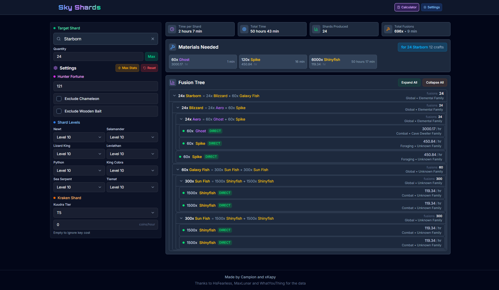
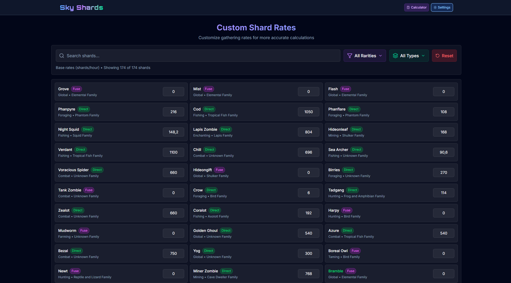

[🌐 Live App](https://skyshards.com/) | [🔗 Alternative Link](https://skyshards-1jk.pages.dev/)

# React + TypeScript + Vite

This template provides a minimal setup to get React working in Vite with HMR and some ESLint rules.

Currently, two official plugins are available:

- [@vitejs/plugin-react](https://github.com/vitejs/vite-plugin-react/blob/main/packages/plugin-react) uses [Babel](https://babeljs.io/) for Fast Refresh
- [@vitejs/plugin-react-swc](https://github.com/vitejs/vite-plugin-react/blob/main/packages/plugin-react-swc) uses [SWC](https://swc.rs/) for Fast Refresh

# Sky Shards Fusion Calculator

A modern, fast, and visually appealing web app for calculating Sky Shard fusions and optimizing shard progression in Hypixel SkyBlock.

---

## What does the app do?

**Sky Shards Fusion Calculator** helps Hypixel SkyBlock players plan and optimize their Sky Shard fusions. You can:

- Instantly search for any Sky Shard and see its fusion requirements.
- Calculate the optimal path and resources needed to craft or upgrade shards.
- Adjust pet levels, Kuudra tier, and other settings for accurate, personalized results.
- Use advanced options like "Max Stats" or "Reset" for quick scenario testing.
- Enjoy a compact, color-coded, and mobile-friendly interface.

Whether you're a casual player or a min-maxer, this tool makes shard progression planning easy and efficient.

---

## UI Screenshots

### Calculator Page



### Settings Page



---

## Features

- 🔍 **Instant Shard Search**: Autocomplete and search for any Sky Shard by name.
- 📊 **Fusion Calculator**: Instantly calculates required resources, optimal paths, and costs for fusing shards.
- 🐸 **Pet & Level Selectors**: Easily set pet levels and Kuudra tier for accurate calculations.
- ⚡ **Performance Optimized**: Ultra-fast, responsive UI with compact, color-coded components.
- 🎨 **Modern UI/UX**: Clean, compact, and color-coded interface for easy navigation and use.
- 🛠️ **Settings & Customization**: Max stats, reset, and advanced options for power users.
- 📱 **Mobile Friendly**: Responsive design for desktop and mobile devices.

## Getting Started

### Prerequisites

- [Node.js](https://nodejs.org/) (v18+ recommended)
- [pnpm](https://pnpm.io/) (or use npm/yarn if preferred)

### Installation

```bash
pnpm install
```

### Development

```bash
pnpm run dev
```

App will be available at `http://localhost:5173` (or as shown in the terminal).

### Build for Production

```bash
pnpm run build
```

### Deploy

```bash
pnpm run deploy
```

## Project Structure

```
src/
  components/         # UI components (calculator, layout, settings, etc.)
    layout/           # Layout and navigation components
    calculator/       # Calculator subcomponents (dropdowns, etc.)
    settings/         # Settings-related components
    search/           # Search/autocomplete components
    tree/             # Recipe tree components
  constants/          # App constants (tiers, max quantities, etc.)
  hooks/              # Custom React hooks
  pages/              # Page-level components
  schemas/            # Zod validation schemas
  services/           # Data and calculation services
  types/              # Shared TypeScript types
  utils/              # Utility functions
public/               # Static assets and data (fusion-data.json, etc.)
```

## Troubleshooting

### Can't Access skyshards.com? Try These Steps:

If you're seeing a 404 error or the site won't load:

**Quick Fixes (try first):**

1. **Hard refresh**: `Ctrl+F5` (Windows) or `Cmd+Shift+R` (Mac)
2. **Try incognito/private mode** in your browser
3. **Wait 10-15 minutes** and try again
4. **Try a different browser** (Chrome, Firefox, Safari, Edge)

**Still not working? Clear DNS cache:**

**Windows:**

```bash
# Open Command Prompt as Administrator:
ipconfig /flushdns
```

**Mac:**

```bash
# Open Terminal:
sudo dscacheutil -flushcache && sudo killall -HUP mDNSResponder
```

**Check DNS (for troubleshooting):**

```bash
# Windows users - run these in Command Prompt:
nslookup skyshards.com
nslookup skyshards.com 8.8.8.8
ipconfig /displaydns | findstr skyshards

# Mac/Linux users:
nslookup skyshards.com
dig skyshards.com
```

**Router Reset:**

- Unplug your router for 30 seconds, then plug back in
- Or restart your internet connection

**Alternative Access:**

- **Direct Cloudflare URL**: https://skyshards-1jk.pages.dev
- **Status Page**: https://skyshards.com/status.html (or https://skyshards-1jk.pages.dev/status.html)
- Try using mobile data instead of WiFi
- Ask someone on a different network to test
- Use a VPN to test from a different location

If none of these work, the issue should resolve automatically within 24-48 hours as DNS propagates globally.

## Contributing

Pull requests and suggestions are welcome! For major changes, please open an issue first to discuss what you would like to change.

## License

MIT

---

_Sky Shards Fusion Calculator is a fan project and not affiliated with Hypixel._
